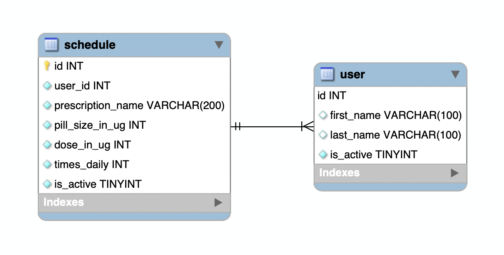

# Event Tracker with REST API

For this project we were instructed to create a web application with REST API endpoints that would allow full CRUD functionality.  My project allows a user to schedule when they need to take their medicine.  This is tracked through two mySQL tables called user and schedule.

## REST Routes for Users:

| Return Type   | Route                   | Functionality                  |
|---------------|-------------------------|--------------------------------|
| `List<User>`  |`GET api/user/`          | Gets all users                 |
| `User`        |`GET api/user/{id}`      | Gets one user by id            |
| `Post`        |`POST api/user/`         | Creates a new user             |
| `Post`        |`PUT api/user/{id}`      | Updates an existing user by id |
| `Boolean`     |`DELETE api/user/{id}`   | Deletes an existing user by id |

## REST Routes for Schedules:

| Return Type       | Route                                 | Functionality                      |
|-------------------|---------------------------------------|------------------------------------|
| `List<Schedule>`  |`GET api/user/{id}/schedule/`          | Gets all schedules by user         |
| `Schedule`        |`GET api/user/{id}/schedule/{id}`      | Gets one schedule by id            |
| `Post`            |`POST api/user/{id}/schedule/{id}`     | Creates a new schedule             |
| `Post`            |`PUT api/user/{id}/schedule/{id}`      | Updates an existing schedule by id |
| `Boolean`         |`DELETE api/user/{id}/schedule/{id}`   | Deletes an existing schedule by id |

## Database Schema:

## Technologies Used:
* Java 8
* Spring Boot
* MySQL
* Apache Tomcat
* MAMP
* CRUD
* J-Unit
* AWS

## AWS Server IP:
http://3.17.253.216:8080/EventREST/api/
